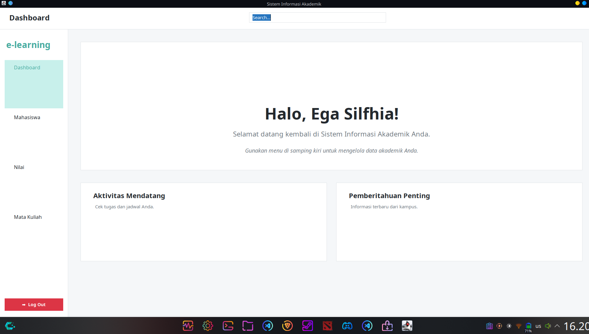
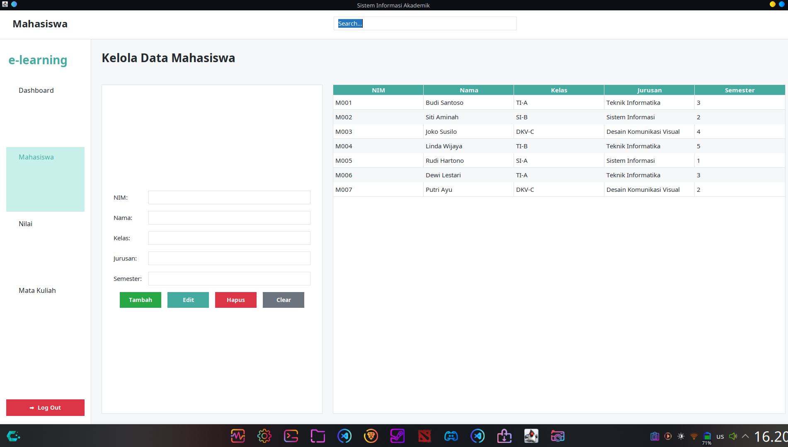
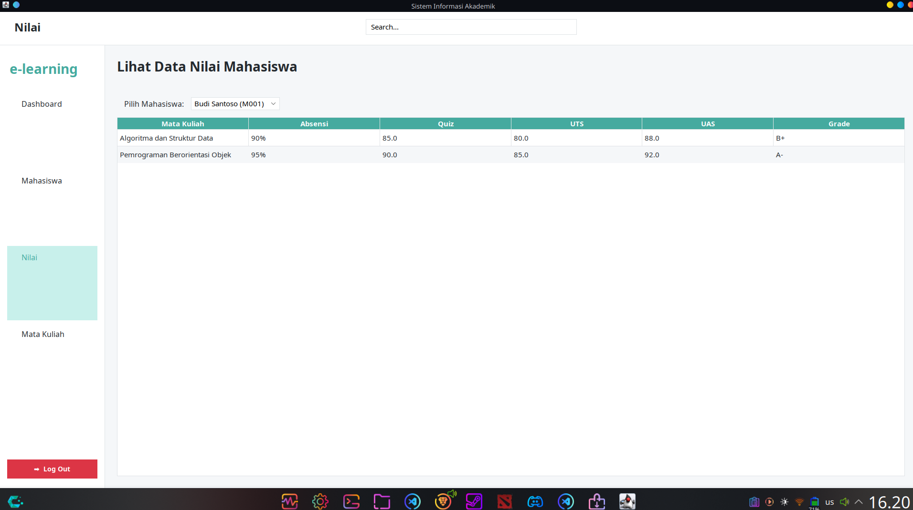
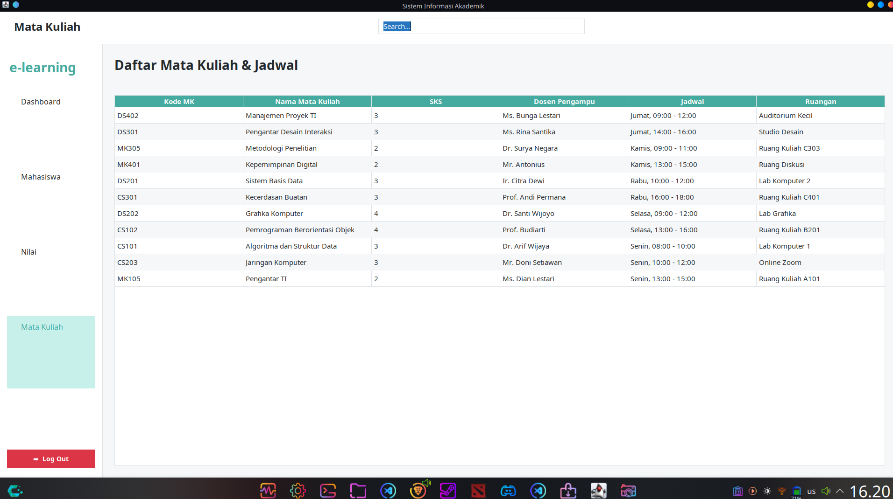

# 💻 Sistem Informasi Akademik (E-Learning) Java

Selamat datang di repositori **Sistem Informasi Akademik** – sebuah aplikasi desktop berbasis Java yang dirancang untuk mengelola data akademik mahasiswa, nilai, serta mata kuliah dan jadwalnya. Proyek ini dikembangkan untuk menyediakan antarmuka pengguna yang intuitif dan fungsionalitas dasar dalam manajemen data akademik.

---

## 🎯 Fitur Utama

-   **Dashboard Interaktif**: Halaman selamat datang yang personal dan ringkasan aktivitas akademik.
-   **Manajemen Mahasiswa**: Tambah, ubah, dan hapus data detail mahasiswa (NIM, Nama, Kelas, Jurusan, Semester).
-   **Lihat Data Nilai**: Menampilkan nilai mahasiswa berdasarkan Absensi, Quiz, UTS, UAS, dan Grade, dengan fitur filter per mahasiswa.
-   **Manajemen Mata Kuliah**: Menampilkan daftar mata kuliah lengkap dengan detail seperti Kode MK, SKS, Dosen, Jadwal (Senin-Jumat), dan Ruangan.
-   **Antarmuka Modern**: Tampilan UI menggunakan FlatLaf untuk pengalaman pengguna yang bersih dan nyaman.
-   **Pencarian Cepat**: Fitur search bar di header untuk navigasi cepat ke halaman tertentu (misal: "Mahasiswa", "Nilai").

---

## 🖼️ Penjelasan Antarmuka

 ### 1. Beranda (Dashboard)
Menampilkan ucapan selamat datang yang personal untuk pengguna, dengan sentuhan visual yang bersih.



### 2. Manajemen Mahasiswa
Kelola data mahasiswa (tambah, edit, hapus) dengan antarmuka formulir dan tabel yang rapi.



### 3. Lihat Data Nilai
Pilih mahasiswa untuk melihat daftar nilai mereka per mata kuliah (Absensi, Quiz, UTS, UAS, Grade).


### 4. Manajemen Mata Kuliah
Menampilkan daftar lengkap mata kuliah beserta jadwal dan ruangan.



---

## ⚙️ Teknologi yang Digunakan

-   **Bahasa Pemrograman**: Java (Disarankan JDK 17 atau lebih baru untuk kompatibilitas FlatLaf, atau sesuai JDK yang Anda gunakan saat kompilasi)
-   **Framework UI**: Swing dengan tema modern dari FlatLaf
-   **Database**: MySQL via JDBC
-   **Build System**: Manual (via `javac` dan `java` CLI)

---

## 📦 Dependensi Eksternal

-   `FlatLaf 3.3` – Tema UI (`flatlaf-3.3.jar`)
-   `MySQL Connector/J 8.0.33` – Koneksi database MySQL (`mysql-connector-j-8.0.33.jar`)

---

## 🔧 Prasyarat

-   Java Development Kit (JDK 17 atau lebih baru direkomendasikan)
-   Server MySQL yang aktif dan berjalan.
-   Database `db_elearning` dengan tabel `mahasiswa`, `matakuliah`, dan `nilai` yang sudah terisi data. (Lihat bagian **Konfigurasi Database**).
-   Dependensi `.jar` (`flatlaf-3.3.jar` dan `mysql-connector-j-8.0.33.jar`) di dalam folder `lib/`.
-   Sistem operasi: Windows, macOS, atau Linux.

---

## 🚀 Instalasi & Penggunaan

### 1. Clone Repositori

```bash
git clone [https://github.com/areksaxyz/ApliksiAkademik)
cd AplikasiAkademik

# Untuk Linux/macOS
javac -cp "lib/flatlaf-3.3.jar:lib/mysql-connector-j-8.0.33.jar" -d src src/com/yourcompany/akademik/main/*.java src/com/yourcompany/akademik/model/*.java src/com/yourcompany/akademik/util/*.java src/com/yourcompany/akademik/dao/*.java src/com/yourcompany/akademik/view/*.java


# Untuk Windows
# java -cp "src;lib\flatlaf-3.3.jar;lib\mysql-connector-j-8.0.33.jar" com.yourcompany.akademik.main.App
